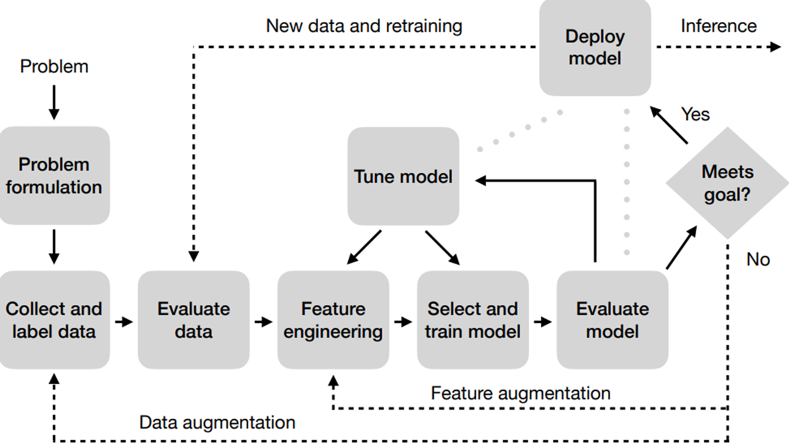

**Overview**

The present work aims to implement a computational solution for studying and analyzing a problem with large-scale data, involving the construction of a machine learning model. The data processed is large and was taken from AWS Open Data (https://registry.opendata.aws/). In the development of this work, in addition to the computational capacity that its authors had at their disposal, services in the Amazon cloud environment for academic context were used: AWS Academy. In terms of tools, the project was implemented using resources provided by Apache Spark and the Python programming language. The implementation of the solution was based on the ML Pipeline methodology, systematized in the figure below.

This report will seek to describe the phases of carrying out the work, how the algorithm is implemented and the main conclusions drawn from its use.

**Full Report**

The full report containing detailed explanations of the developed work, as well as the obtained results is present in the '*Relatorio_Grupo_AS.pdf*' file.
